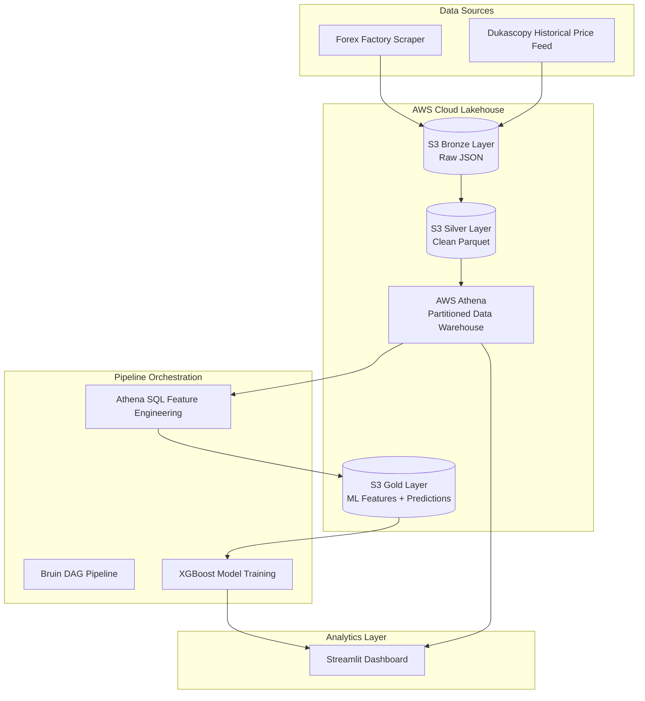

# Forex Macro Intelligence Lakehouse & Volatility Predictor


---

## Problem Statement

### The Problem

Retail Forex traders often rely heavily on technical indicators while underutilizing macroeconomic fundamentals. Major economic announcements such as CPI, GDP, and Non-Farm Payrolls significantly influence currency markets, but manually collecting, cleaning, aligning, and modeling these macro events against historical price action is inefficient and technically demanding.

### The Solution

This project delivers a fully automated **Cloud-Native Forex Intelligence Lakehouse** that:

1. Scrapes macroeconomic calendar events from Forex Factory.
2. Ingests historical hourly Forex price action from Dukascopy.
3. Calculates economic **Surprise Factor** (`Actual - Forecast`).
4. Aligns macro events precisely with hourly market candles.
5. Engineers machine learning-ready macro features.
6. Trains an **XGBoost predictive model** for macro trend forecasting.
7. Serves insights via an interactive **Streamlit dashboard**.

---

## Project Architecture



---

## Cloud Engineering & Infrastructure

### AWS Services Used

* **Amazon S3** → Bronze, Silver, Gold storage layers
* **AWS Athena** → Serverless analytical warehouse
* **AWS Glue Catalog** → Metadata management
* **Terraform** → Infrastructure as Code provisioning

### Infrastructure as Code

Terraform provisions:

* S3 Data Lake Bucket
* Glue Catalog Database
* Athena Workgroup

This ensures:

* Reproducibility
* Scalability
* Environment consistency
* Professional deployment standards

---

## Pipeline Workflow

### Batch DAG Orchestration via Bruin

The pipeline executes:

### Bronze Layer

* `scrape_forexfactory.py`
* `ingest_dukascopy.py`

### Silver Layer

* `process_forexfactory.py`
* `process_dukascopy.py`
* `create_athena_tables.py`

### Gold Layer

* `feature_engineering.sql`

### ML Layer

* `train_macro_trend.py`

### Trigger Layer

* `trigger_pipeline.py`
* `run_pipeline.bat`

---

## 🗄️ Data Warehouse Partitioning Strategy

### `forex_calendar`

Partitioned by:

* `year`
* `month`

### `price_action`

Partitioned by:

* `pair`
* `year`

### Why this matters:

* Minimizes Athena scan costs
* Improves query speed
* Supports large-scale time-series filtering
* Optimizes upstream ML joins

---

## Machine Learning Design

### Model:

**XGBoost Regressor**

### Input Features:

* Total monthly surprise
* Average surprise
* High-impact event count
* Monthly trend

### Prediction Target:

* Next month macro price trend

### Outputs:

* Serialized models (`models/`)
* Live forecasts in Gold Layer
* Dashboard visualizations

---

## Dashboard Features

### Streamlit Analytics Hub

Provides:

### 1. Historical Macro Feature Feed

* Surprise factor analysis
* Event-price alignment
* Market reaction patterns

### 2. AI Forecast Layer

* Next-month predictions
* Model outputs
* Macro directional bias

### 3. Automated Athena Sync

* Partition repair
* Schema refresh
* Metadata correction

---

## Repository Structure

```text
forex_ml_capstone/
│
├── README.md
├── requirements.txt
├── run_pipeline.bat
├── silent_run.vbs
├── trigger_pipeline.py
├── .bruin.yml
│
├── config/
│   └── pipeline_config.yaml
│
├── dashboard/
│   └── app.py
│
├── infrastructure/
│   └── terraform/
│       └── main.tf
│
├── models/
│   ├── xgboost_macro_2025.pkl
│   └── xgboost_macro_2026.pkl
│
├── pipeline/
│   ├── pipeline.yml
│   ├── requirements.txt
│   └── assets/
│       ├── bronze/
│       │   ├── scrape_forexfactory.py
│       │   └── ingest_dukascopy.py
│       │
│       ├── silver/
│       │   ├── process_forexfactory.py
│       │   ├── process_dukascopy.py
│       │   └── create_athena_tables.py
│       │
│       ├── gold/
│       │   └── feature_engineering.sql
│       │
│       └── ml/
│           └── train_macro_trend.py
```

---

## Key Engineering Highlights

### Production-Grade Design Strengths

* **Idempotent Operations:** All ingestion and transformation layers safely overwrite partitioned datasets without duplication.
* **Resilient Web Scraping:** SeleniumBase undetected browser automation bypasses anti-bot protections and extracts raw JavaScript payloads directly.
* **Zero-ETL Warehouse:** AWS Athena queries analytical Parquet datasets directly from S3 without requiring traditional database loading.
* **Schema-Enforced Parquet Architecture:** Silver Layer standardizes schemas for ML consistency and cost-efficient analytics.
* **Partition Pruning Optimization:** Hive-style partitioning dramatically reduces Athena scan costs and accelerates macroeconomic joins.
* **Gold Feature Store:** Gold Layer serves as a machine learning-ready feature registry for predictive macroeconomic modeling.

---

## Reproducibility Guide

## Step 1: Clone Repository

```bash
git clone https://github.com/yourusername/forex_ml_capstone.git
cd forex_ml_capstone
```

## Step 2: Environment Setup

```bash
python -m venv venv
source venv/bin/activate
pip install -r requirements.txt
```

## Step 3: Configure `.env`

```env
AWS_ACCESS_KEY_ID=your_key
AWS_SECRET_ACCESS_KEY=your_secret
AWS_DEFAULT_REGION=eu-north-1
S3_BUCKET_NAME=your_bucket
TARGET_YEAR=2026
```

## Step 4: Provision Infrastructure

```bash
cd infrastructure/terraform
terraform init
terraform apply
```

## Step 5: Run Pipeline

### Windows:

```cmd
.\run_pipeline.bat
```

### Direct Bruin:

```bash
bruin run pipeline/
```

## Step 6: Launch Dashboard

```bash
streamlit run dashboard/app.py
```

---

## Technical Highlights

### Advanced Data Platform Capabilities

* Cloud-native end-to-end architecture
* Zero-ETL analytical warehouse
* ML feature store implementation
* High-resilience web extraction
* Serverless analytical engineering
* Infrastructure as Code deployment

### Data Engineering

* Medallion architecture
* Cloud lakehouse design
* Automated partitioning
* Production-grade orchestration

### Cloud Engineering

* AWS-native architecture
* Athena serverless warehousing
* Terraform deployment

### Analytics Engineering

* SQL feature engineering
* Macro-event alignment
* Time-series optimization

### Machine Learning

* Feature registry
* XGBoost forecasting
* Prediction persistence

---

## Future Improvements

* Real-time streaming via Kafka/Kinesis
* CI/CD deployment pipelines
* Multi-currency expansion
* Advanced SHAP explainability
* Live trading signal integration
* Docker/Kubernetes deployment

---

## Author Positioning

This project demonstrates professional competency across:

* Data Engineering
* Analytics Engineering
* Cloud Infrastructure
* Machine Learning Operations
* Financial Data Systems

It serves as a portfolio-grade showcase for:

* Data Engineer roles
* Analytics Engineer roles
* ML Engineer roles
* Cloud Data Platform roles

---

## 📜 License

MIT License
